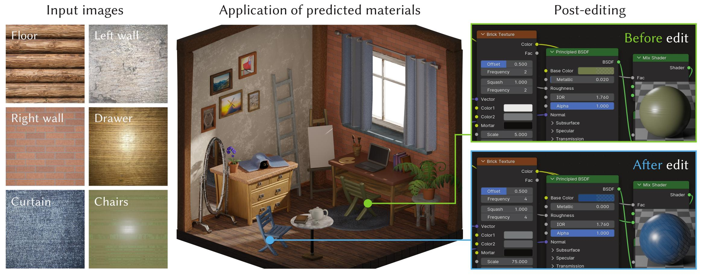

# VLMaterial



Source code for ICLR 2025 Spotlight paper "**VLMaterial: Procedural Material Generation with Large Vision-Language Models**" by Li et al. ([\[arXiv\]](https://arxiv.org/abs/2501.18623), [\[OpenReview\]](https://openreview.net/forum?id=wHebuIb6IH))

This repository comprises three parts:
1. `data_scripts/` - Python scripts for training data pre-processing and augmentation;
2. `infinigen/` - A forked version of the [Infinigen](https://github.com/princeton-vl/infinigen) repo for building Blender with required Python libraries;
3. `llava_hf/` - Implementation of VLM training and inference.

## Installation

Clone the repo in your workspace.

```bash
cd /path/to/workspace
git clone git@github.com:mit-gfx/VLMaterial.git
```

### Python Environment

For Anaconda/Miniconda users, we recommend creating a Python virtual environment using the provided configuration file.
```bash
cd VLMaterial
conda env create -f environment.yml
conda activate vlmaterial
```

For other users, install the following packages in a Python 3.10 environment using `pip`:
- Base libraries:
  ```bash
  pip install numpy scipy Pillow pyyaml tqdm
  ```
- PyTorch 2.4.1 (refer to the [official guide](https://pytorch.org/get-started/previous-versions/#v241) for other installation options):
  ```bash
  pip install torch==2.4.1 torchvision==0.19.1 --index-url https://download.pytorch.org/whl/cu118
  ```
- Hugging Face related libraries:
  ```bash
  pip install transformers==4.45.2 peft==0.13.2 accelerate==1.0.1 deepspeed==0.15.2
  ```
- OpenAI Python API:
  ```bash
  pip install openai
  ```
- Utility libraries:
  ```bash
  pip install lpips tensorboardX fake-bpy-module-3-3
  ```

For **all users**, install the Flash Attention library with `pip`:
```bash
wget https://github.com/Dao-AILab/flash-attention/releases/download/v2.6.3/flash_attn-2.6.3+cu118torch2.4cxx11abiFALSE-cp310-cp310-linux_x86_64.whl
pip install flash_attn-2.6.3+cu118torch2.4cxx11abiFALSE-cp310-cp310-linux_x86_64.whl --no-build-isolation
rm flash_attn*.whl
```
> [!WARNING]
> You should download the pip wheel that is compatible with PyTorch's build configuration.
> 
> The example command assumes `_GLIBCXX_USE_CXX11_ABI=0`, which applies to most PyTorch distributions on Conda and Pip. Switch to [alternative wheels](https://github.com/Dao-AILab/flash-attention/releases/tag/v2.6.3) if you built PyTorch from source with `_GLIBCXX_USE_CXX11_ABI=1`.

### Infinigen

Although we barely use any code from Infinigen, it is still required to install a dedicated Blender distribution which includes additional packages in the internal Python environment.

Simply follow Infinigen's [installation guide](infinigen/docs/Installation.md) and ignore the `git clone` step since we already have the repo locally.

### X11 Display Server

As we will render procedural materials using Blender's OpenGL-based EEVEE renderer, we need to set up an X11 display server to provide OpenGL contexts, especially in a headless environment.

> [!NOTE]
> The instructions below are intended for machines hosting Ubuntu 22.04 or later with NVIDIA GPUs. The same procedure should apply to alternative software and hardware but the exact steps might be different.

- If your machine is connected to a **desktop monitor**, an X11 display is most likely already running. Check its status with:
  ```bash
  glxinfo | head
  ```
  The output should normally include the name of the display (e.g., `:1`) and GPU vendor information.
- If you are accessing a **remote server via SSH**, make sure the GPU driver is properly installed by checking `nvidia-smi`.

  Create an X11 configuration file `/etc/X11/xorg.conf` using `nvidia-xconfig`:
  ```bash
  sudo nvidia-xconfig --enable-all-gpus
  ```
  If needed, you can manually edit `xorg.conf` to ensure it properly includes all GPUs and the screens are correctly assigned.

  Then, manually start the X server. Export the `DISPLAY` variable so that OpenGL applications can connect to the X server:
  ```bash
  sudo X :0 &
  export DISPLAY=:0
  ```

  Verify that OpenGL rendering is working with the following command. If everything is set up correctly, you should see your NVIDIA GPU listed as the OpenGL renderer.
  ```bash
  glxinfo | grep "OpenGL renderer"
  ```

## Usage

This section covers training and inference using our released dataset. Please skip to "[Creating Your Own Dataset](#creating-your-own-dataset)" for more information on how to set up a custom dataset for your task.

> [!IMPORTANT]
> We recommend fine-tuning the [LLaVA-NeXT](https://llava-vl.github.io/blog/2024-05-10-llava-next-stronger-llms/) model described in our paper (based on LLaMA-3 8B) using GPUs with at least **48GB VRAM**, e.g., RTX A6000, A100, or better.

### Dataset

Download the dataset archive from [this link](https://drive.google.com/file/d/1k85IeCpKsduPbSycWLgnw5c1NxM_ENl4/view?usp=sharing) and place it in the repo folder. Then, decompress the dataset.
```bash
cd /path/to/workspace/VLMaterial
unzip -q material_dataset_filtered.zip
```

Verify that the dataset is in the right location using the following command, which should return the relative path as-is without raising an error.
```bash
ls material_dataset_filtered/infinigen/wood/blender_full.py
```

### Pre-Trained Weights

The pre-trained weights are available via [this link](https://drive.google.com/file/d/1mx66RcGFZIN2f-vDvU1NWtNRBvwHZyDx/view?usp=sharing). Download the ZIP archive and decompress its content into `llava_hf/`.
```bash
unzip -q checkpoints_pretrained.zip -d llava_hf/
```

### Training

Pre-cache the VLM checkpoint into local storage before the first training run.
```bash
python -c "from transformers import AutoModelForVision2Seq as AM; AM.from_pretrained('llava-hf/llama3-llava-next-8b-hf')"
```

Edit the training script `llava_hf/scripts/peft_sllm_p10.sh`:
- Update `ROOT_DIR` using the path to the cloned repo.
- Specify the GPU IDs used for training at `DEVICE_IDS` and change `--per_device_train_batch_size` and `--per_device_eval_batch_size` based on available GPU VRAM. The default settings apply to 8x H100 80GB GPUs.

Run the edited script to start training.
```bash
cd llava_hf
bash scripts/peft_sllm_p10.sh
```

Model checkpoints are saved to `checkpoints/llava-llama3-8b-sllm-p10`.

### Inference

The inference process entails two steps:
1. **Generation** - The model generates a series of candidate material programs for each test image from random sampling.
2. **Rendering** - The verifier checks the correctness of the generated candidates and renders valid materials into images.

Edit the corresponding scripts, `llava_hf/scripts/eval_sllm_p10.sh` and `llava_hf/scripts/render_sllm_p10.sh`, respectively:
- Update `ROOT_DIR` using the path to the cloned repo.
- If using the pre-trained weights, change `--model_path` to `${WORK_DIR}/checkpoints_pretrained/${EXP_NAME}/checkpoint-epoch5`.
- Set `--display_id` with the display number (e.g., `1` for the X11 display `:1`).
- Specify the number of GPUs with `--num_processes` and provide their IDs using `--device_id`.

Execute the scripts in order.
```bash
bash scripts/eval_sllm_p10.sh       # Generation
bash scripts/render_sllm_p10.sh     # Rendering
```
The results are located in `results/llava-llama3-8b-sllm-p10/eval-epoch5`, where each folder stores an input image, the generated materials, and their renderings.

> [!TIP]
> We noticed that Blender renders much faster on conventional gaming and workstation GPUs (or data center GPUs with graphics-oriented architectures), such as RTX 3090, RTX A6000, and L4, than AI-focused GPUs like A100 and H100. Therefore, we recommend running Step 2 on dedicated rendering GPUs.
>
> This tip also works for other rendering-heavy tasks like node parameter optimization and dataset creation, which will be introduced later.

### Node Parameter Post-Optimization

You can run `param_search.py` to further optimize the node parameters of generated materials using Markov Chain Monte Carlo (MCMC) sampling. The example command below runs node parameter optimization on 8 GPUs in parallel:
```bash
python param_search.py results/llava-llama3-8b-sllm-p10/eval-epoch5 --max_iter 200 --num_processes 8 --display_id 0 --device_id 0 1 2 3 4 5 6 7
```

where the `--max_iter` argument controls the number of MCMC iterations in each optimization.

The optimized materials are saved to `results_opt/llava-llama3-8b-sllm-p10/eval-epoch5` which has the same structure as the inference result.

## Creating Your Own Dataset

We provide the necessary tools to build and augment a procedural material dataset for VLM fine-tuning in the `data_scripts/` folder.

The process takes Blender procedural materials in the `*.blend` format as input. Start by collecting materials over the Internet and organizing them into the following directory structure (the example folder names are placeholders):
```
/path/to/workspace/VLMaterial
└── material_dataset/               # Root folder of source materials
    ├── source_1/                   # Each `source_i` folder contains materials downloaded from the same source
    │   ├── material_1/             # `material_j` refers to the material name and must be unique
    │   │   └── material.blend      # Blender file containing the shader node graph
    │   ├── material_2/
    │   ├── ...
    │   └── material_M/
    ├── source_2/
    │   ...
    └── source_N/
```

> [!TIP]
> As mentioned previously, we recommend running the scripts in this section on dedicated rendering GPUs for optimal performance. For instance, we used 8x NVIDIA L4 24GB GPUs in our paper.

### Pre-Filtering

First, iterate over the dataset to identify node types, including custom node groups.
```bash
cd /path/to/workspace/VLMaterial
python data_scripts/analyze_all.py --data_root material_dataset --output_folder material_dataset_info
```

Make sure the OpenGL renderer is active by checking the output of `glxinfo`. Filter materials that have excessively large node graphs or do not render into meaningful appearances.
```bash
glxinfo | grep "OpenGL renderer"    # The output should show the GPU for rendering
python data_scripts/filter_all.py --data_root material_dataset --info_dir material_dataset_info --output_folder material_dataset_filtered
```

The materials that have passed filtering are stored in `material_dataset_filtered/` with the same structure.

### Graph Structure Augmentation

Our implementation invokes OpenAI's [Python API](https://github.com/openai/openai-python) to prompt a commercial LLM to write novel procedural material programs.

Edit `data_scripts/gen_programs_llm_async.py` and fill in your API credentials at the instantiation of the `AsyncOpenAI` client. An example command is shown below:
```bash
python data_scripts/gen_programs_llm_async.py -d material_dataset_filtered -i material_dataset_info -o material_dataset_filtered/llm -n 500 --num_workers_gen 8 --num_workers_verify 8 --display_id 0 --device_id 0 1 2 3 4 5 6 7
```

Explanations for command line options:
- `-n 500`: Randomly sample 500 pairs of programs. The LLM rewrites each program pair into several new candidate programs.
- `--num_workers_gen 8`: Use 8 asynchronous workers to query the LLM.
- `--num_workers_verify 8`: Use 8 parallel workers to validate the correctness of generated programs, including OpenGL rendering.
- `--display_id`, `--device_id`: Specify the X11 display name and the associated GPU IDs.

Other useful options:
- `--model_id`: Indicate which LLM to use. Defaults to `gpt-4o-mini`.
- `--num_samples`, `--max_samples`: The LLM generates up to `max_samples` programs for each randomly sampled program pair. The verifier picks the first `num_samples` correct programs until exhausting the generated programs.

Next, add the validated programs into the dataset and follow the same directory structure as existing materials:
```bash
python data_scripts/copy_subset_llm.py -s material_dataset_filtered/llm -o material_dataset_filtered/mat_llm
```

> [!NOTE]
> You can repeat the commands in this section to conduct multiple rounds of augmentation. Choose a different output folder in each round to avoid overwriting previous results.

### Parameter-Space Augmentation

The following command augments the dataset with parameter-space variations:
```bash
python data_scripts/sample_params_all.py --data_root material_dataset_filtered --info_dir material_dataset_info --output_folder material_dataset_filtered --num_processes 8 --display_id 0 --device_id 0 1 2 3 4 5 6 7
```

Useful command line options:
- `--num_processes`: Parallelize the generation and verification of material variations over multiple GPUs (designated by `--device_id`).
- `--num_samples`, `--max_samples`: Randomly sample up to `max_samples` node parameter variations for each material. The first `num_samples` valid variations are added to the dataset.

The hyperparameters of parameter sampling are currently hard-coded in `sample_params.py` and can be tweaked as needed.

In addition, the augmented materials are placed alongside the original materials in their respective folders. The resulting directory structure is:
```
/path/to/workspace/VLMaterial
└── material_dataset_filtered/          # Material dataset folder
    └── source_i/                       # Just an example for simplicity
        └── material_j/
            ├── analysis_result.json    # Node type information and parameter values
            ├── blender_full.py         # Transpiled Python program
            ├── transpiled_render.jpg   # Material rendering
            ├── var_00000_full.py       # Parameter variation 0 (Python code)
            ├── var_00000_render.jpg    # Parameter variation 0 (rendering)
            ├── var_00001_full.py       # Parameter variation 1 (Python code)
            ├── var_00001_render.jpg    # Parameter variation 1 (rendering)
            └── ...
```

### Training/Testing Splits

At the last step, we divide the augmented dataset into training, validation, and test splits.
```bash
python data_scripts/package_data.py --data_root material_dataset_filtered --info_dir material_dataset_info --output_folder material_dataset_filtered/dataset_splits --add_llm --filter_llm --save_prefix llava_sllm_p10_
```

This command generates three JSON files, `llava_sllm_p10_{train|val|test}.json`, in the `material_dataset_filtered/dataset_splits` folder.

Useful command line options:
- `--split_ratios`: The fraction of data in each split. Defaults to `0.9 0.05 0.05` (train/valid/test).
- `--add_llm`: Incorporates LLM-generated materials into training data.
- `--filter_llm`: Optionally removes LLM-generated materials that are too similar to validation/testing materials.

## Citation

We would appreciate it if you cite our paper when using this codebase in your project.

```bibtex
@inproceedings{li2025vlmaterial,
  title={{VLM}aterial: Procedural Material Generation with Large Vision-Language Models},
  author={Beichen Li and Rundi Wu and Armando Solar-Lezama and Liang Shi and Changxi Zheng and Bernd Bickel and Wojciech Matusik},
  booktitle={The Thirteenth International Conference on Learning Representations},
  year={2025},
  url={https://openreview.net/forum?id=wHebuIb6IH}
}
```

## Contributions

Please contact [beichen@mit.edu](mailto:beichen@mit.edu) if you have any questions. This repository is provided as an archival reference for the paper. Contributions will not be actively reviewed or merged.

## License

The code and pre-trained weights are released under the [MIT License](LICENSE) - see the [LICENSE](LICENSE) file for details.

The Blender procedural material dataset is released under the [CC BY-NC 4.0 License](https://creativecommons.org/licenses/by-nc/4.0/) for **non-commerical** purposes only.

## Acknowledgements

This material is based on work that is partially funded by an unrestricted gift from Google.
